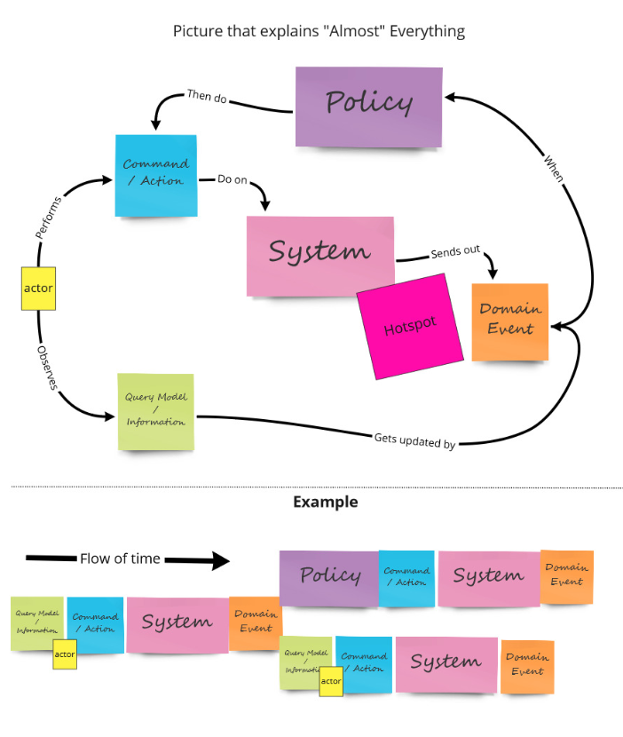
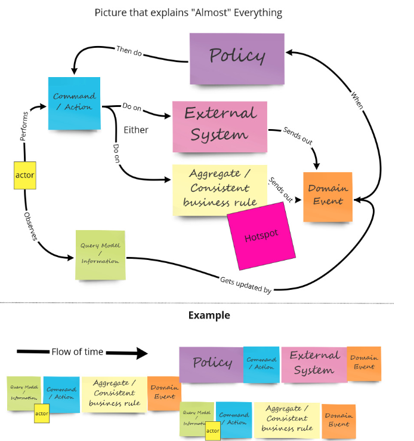

# Event Storming 事件风暴

## 元素

|名称               |颜色   | Comments | 
|-------------------|------| ------------------------- |
|事件 - Event       | 橙色  | 名词 + 动词 (被动语态)     |
|用户角色 - User/Actor  | 深黄色  | |
|命令 - Command     | 蓝色  ||
|阻塞的问题 - | 紫色 ||
|外部系统 - External System  | 粉色 ||
|读模型 - Read/Query Model | 蓝色 ||
|策略 - Policy | 淡紫色 | 包括业务规则校验|
|大片黄色 - 

## 事件风暴 - 全领域探索/探索业务全景
* 由领域专家贴出最关心的一个领域事件
* 大家开始分别从这个事件出发，
  * 从事件开始，向左边出发，探索事件发生之前
  * 从事件开始，向右边出发，探索事件发生之后
__Note__ 注意这里只注重事件的探索，倘若存在疑问，又或者需要提醒业务人员或技术人员特别注意，可以用粉红色即时贴来表达该警告信息，Alberto Brandolini 将其称之为“热点 Hot Spot”
* 由此，根据时间流+事件，我们可以获得 全景事件流。
* 接着，就要对各个事件的起因进行分析，事件起因一共
  * 由用户角色触发 => 黄色小人表示
  * 当前置事件满足时触发，这里就是所谓的 事件策略 => 紫色
  * 外部系统 => 浅粉色

## 事件风暴 - 领域分析

* 在得到领域事件的前提之下，需要对 command 进行分析，一般command是由三个元素发出
  * 外部系统
  * 用户活动
  * 满足某个条件 => 策略 policy
__Note__ command 连接了用户、策略、聚合、读模型和事件

* 通过分析 事件的 因，我们可以驱动出 Command 决策命令。
* 通过探索 Command 决策命令 的发出者，我们可以得到 外部系统/用户/策略(policy) 这三个元素
* 而用户在引发决策命令时，需要足够的信息来帮助它做出正确的决策，那么我们就可以得到 读模型 readmodel
* 紧接着，如果 一个事件和command 之间是有一个 聚合的概念，事件是由 聚合 发出的。 由于它是由决策命令触发的，意味着事件的产生会带来目标对象状态的变化。状态的变化分为三种形式：
  * 从无到有：意味着创建，例如“订单已创建”事件标志着新订单的产生。
  * 修改属性值：意味着值的更新，例如“订单已取消”事件使得订单从之前的状态变更为“已取消”状态；也可能意味着内容的变化，例如“商品被加入到购物车”事件，说明购物车增加了一个新的条目。
  * 从有到无：意味着删除，不过在多数项目中并不存在这种状态变化；表面是删除，实际是修改属性值。例如“会员已注销”事件和“商品已下架”事件，实则都不是直接删除会员和商品记录，而是将该记录的状态置为“已注销/已下架”状态。

==============================================================================

## 业务流程-事件风暴
* 领域专家阐述业务流程
* 贴出 **橙色事件** （领域事件）
    * 这里由参加会议的人，贴出，描述
    * 遇到问题，阻塞，用 **紫色问题** 记录，与领域事件相关联，也是后面优化的重点
* 针对核心的 事件 ，开始探索其运行机制和上下文
    * 引入 **蓝色命令** （Command）和 **黄色用户角色**
    
    * 这里，就需要考虑是什么能够让**用户**做出决定/动作? 这里，我们就需要引入 **绿色读模型** 。可以由**读模型**得到UI。
        * 提问：什么用户会做出决定？为什么做出这个决定？
        * 提问：能让用户更容易的做出决定？
        * 提问: 能帮助用户做出更好的决定？
        * 提问：用户决定的依据是什么？    
    这些问题将帮助我们思考与用户做决定相关的数据模型.  此外，不同类型用户，做出决定的背后动机是不同的。根据这个能够细分不同用户角色。
    
    * 随着讨论加深，整个业务逐渐清晰。
    * 当出现“当...发生时...”/“whenever X happens, we do Y”语句描述的时候，可以把这种行为逻辑称为**淡紫色策略**。**策略**一般会在**命令**与**事件**之间，可以是自动或者手动的逻辑过程。他可以是业务规则（eventual business constraint or rule or a lie detector）。策略越早捕获对系统越有利。
    
    * 最后把一组同一概念的**命令**和**事件**，归纳合并组合，进行大归类,使用大**黄色**。  
    
    

##  软件设计-事件风暴
基于业务的事件风暴结果，最后进行归类的，我可以称之为聚合，

## Reference
* [事件风暴建模101](https://www.jianshu.com/p/8a7814f3e9ac)   
* [DDD 实践手册 (番外篇: 事件风暴 - 实践)](https://xie.infoq.cn/article/e36e68f9c6516fa10cf546f32)